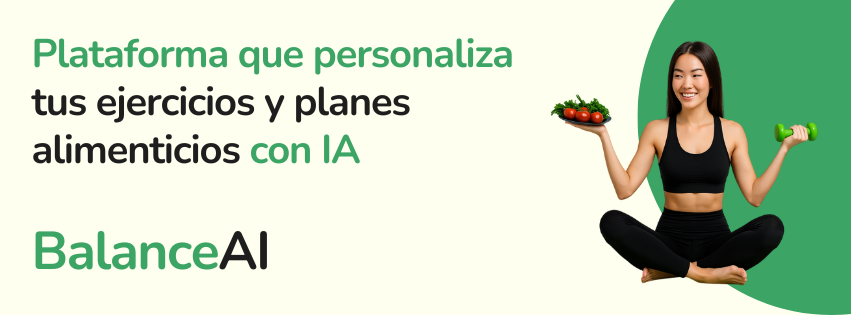
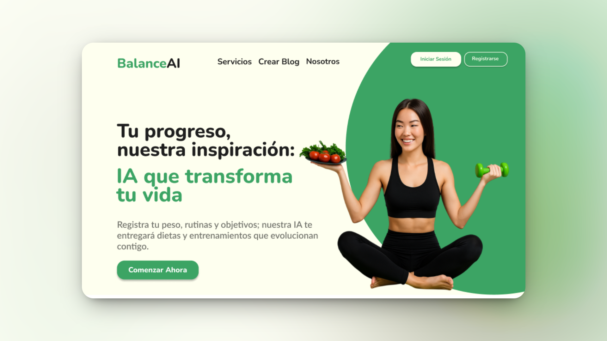
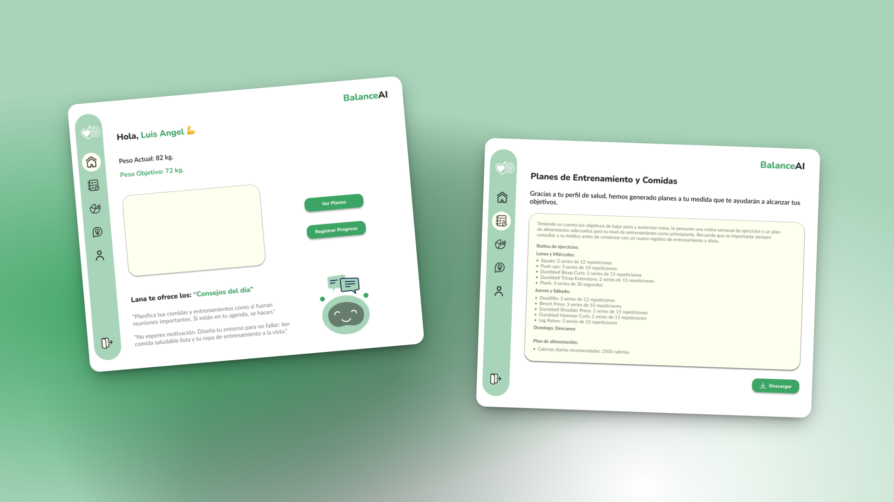

<div align="center">
  
</div>

# 🧠 BalanceAI | Plataforma de Salud Inteligente

**BalanceAI** es una plataforma que une inteligencia artificial, nutrición y ejercicio para ayudarte a alcanzar un estilo de vida saludable y sostenible.  
Nuestra app te guía con planes personalizados, análisis de progreso y recomendaciones dinámicas adaptadas a tus objetivos.

---

<div align="center">

</div>

## 🎯 Propósito del Proyecto

Desarrollar una plataforma inteligente que combine datos de salud y preferencias del usuario para generar planes alimenticios y rutinas de entrenamiento completamente personalizadas. El objetivo es mejorar la calidad de vida de las personas mediante IA aplicada a su bienestar.

---

## ❗ Problemática y Solución

- **Problema:** Muchas personas desean mejorar su salud, pero no saben por dónde empezar ni cómo mantener un plan sostenible a largo plazo.
- **Solución:** BalanceIA actúa como un entrenador y nutricionista inteligente que ajusta tus planes según tu progreso, motivándote y guiándote con datos en tiempo real.

---

## ✨ Funcionalidades Principales

- 🥗 **Planes de alimentación personalizados** según tus metas y gustos.
- 🏋️ **Rutinas de ejercicio adaptativas** según tu experiencia y progreso.
- 📈 **Dashboard de progreso** con gráficos de peso, comidas y repeticiones.
- 🤖 **Recomendaciones inteligentes** generadas por IA en base a tus registros diarios.
- 📱 **App web y móvil sincronizadas** con experiencia fluida multiplataforma.
- 📋 **Registro diario** de comidas, peso y entrenamientos.

---

## 🔁 Flujo del Usuario

1. Registras tus datos iniciales (objetivos, peso, preferencias).
2. La IA genera un plan de alimentación y entrenamiento personalizado.
3. Registras tus avances diarios (comidas, ejercicios, peso).
4. El sistema analiza tu progreso y ajusta el plan automáticamente.

---

## 🎨 Diseño UX/UI

<div align="center">
  
</div>

---

## 🧠 Tecnologías Utilizadas

### 🎨 UX/UI Design


### 🖥️ Frontend


### 📱 App Móvil


### ⚙️ Backend


### ☁️ Despliegue


### 🛠️ Herramientas


---

## 🤝 Nuestro Equipo

<table align="center">
  <tr>
    <td align="center">Luis Angel Quispe </td>
    <td align="center">Christian Aranguiz </td>
    <td align="center">Jose Magdiel Perez </td>
    <td align="center">Agata Morales Celestino </td>
    <td align="center">Matias Ron Ares </td>
  </tr>
  <tr>
    <td align="center">PM & Frontend Developer & UX/UI</td>
    <td align="center">Frontend Developer</td>
    <td align="center">Backend & AI</td>
    <td align="center">Backend Developer</td>
    <td align="center">UX/UI</td>

  </tr>
  <tr>
    <td align="center">
      <a href="https://www.linkedin.com/in/luis-angel-quispe/">
        
      </a>
    </td>
    <td align="center">
      <a href="https://www.linkedin.com/in/christian-aranguiz/>
        
      </a>
    </td>
    <td align="center">
      <a href="https://www.linkedin.com/in/jose-magdiel-mora-perez-0384492b9/">
        
      </a>
    </td>
    <td align="center">
      <a href="https://www.linkedin.com/in/agata-morales/">
        
      </a>
    </td>
        <td align="center">
      <a href="https://www.linkedin.com/in/mat%C3%ADas-ron-ares-a4b09819a/">
        
      </a>
    </td>
  </tr>
</table>

---

## 🔗 Enlaces del Proyecto

[](https://express3.vercel.app/) [](https://www.figma.com/design/44hJ5JA2JttVOnmcTGeFFD/BalanceIA?node-id=0-1&t=dUGwEkSe8444373I-1)

---

## ⚙️ Instalación Local

### 🔹 Clonar el repositorio

```bash
git clone https://github.com/M41k80/express3.git
cd express3
```

### 🔹 Instalar el Frontend Web

```bash
cd frontend
npm install
npm run dev
```

### 🔹 Instalar la App Móvil

```bash
cd mobile-app
npm install
npx run ios   # Para iOS
npx run android   # Para Android
```

⚠️ Asegúrate de tener instalado Expo Go o un emulador Android/iOS.

## 📸 Capturas del Proyecto en Mobile

<div align="center">
  
  
  
  
  
  
</div>

---

## 🤝 Contribuciones

¡Toda ayuda es bienvenida!  
Puedes colaborar con ideas, issues o mejoras.  
Abre un Pull Request o crea una nueva issue para hacernos saber tus aportes.

---

## 📄 Licencia

MIT © BalanceAI
