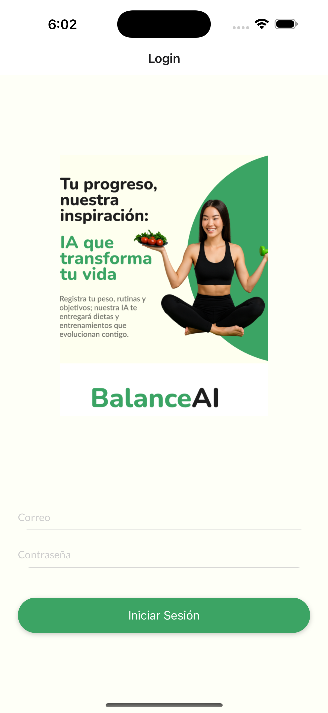
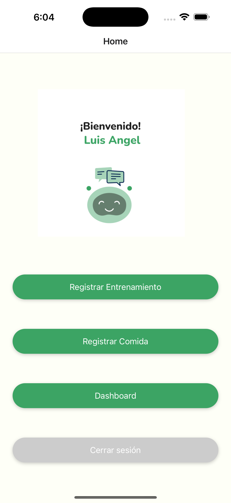
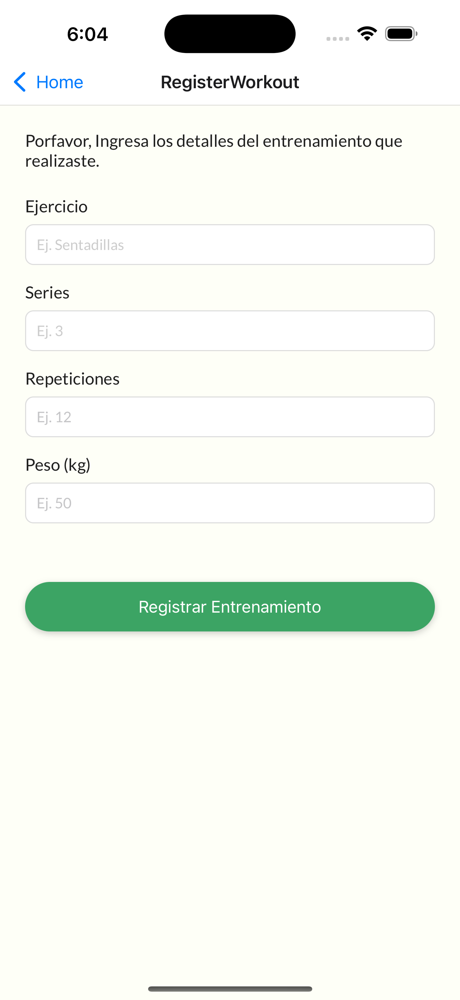
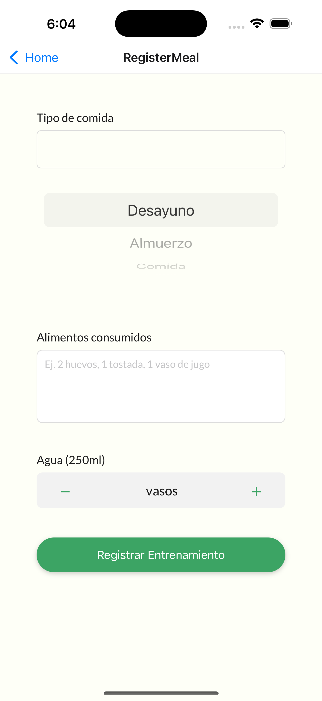
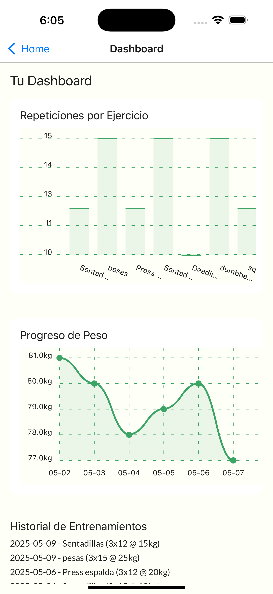
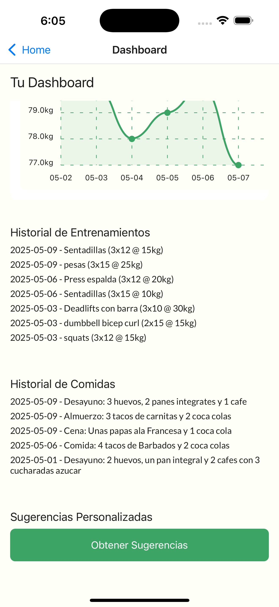

# 🧠 BalanceIA

**BalanceIA** es una plataforma inteligente de salud que combina inteligencia artificial con rutinas de ejercicio y alimentación personalizadas para ayudarte a llevar una vida más saludable y equilibrada.


---

## ✨ Características

- 🥗 **Planes de alimentación personalizados** según tus metas y preferencias.
- 🏋️ **Rutinas de entrenamiento adaptativas** basadas en tu progreso y nivel de experiencia.
- 📈 **Dashboard de progreso**: gráficos de peso, repeticiones y comidas.
- 🤖 **Sugerencias inteligentes** generadas por IA usando tus registros.
- 📱 **Aplicación web y móvil** con sincronización en tiempo real.
- 📋 **Registro diario** de comidas, peso y entrenamientos.

---

## 🧩 Tecnologías utilizadas

- **Frontend Web:** Next.js 15 + Tailwind CSS
- **App móvil:** React Native + Expo
- **Backend API:** FastAPI (Python)
- **IA generativa:** Mistral 7B vía OpenRouter
- **Base de datos:** Supabase (PostgreSQL)
- **Autenticación:** JWT Nest js (PostgreSQL)
- **Gráficos:** `react-native-chart-kit`, `recharts`
- **Otros:** Axios, Zustand, React Navigation, jspdf, html2canvas
- **Despliegue** Vercel, Railway, Render

---

## ⚙️ Instalación local

### 1. Clonar el repositorio

```bash
git clone https://github.com/M41k80/express3.git
cd express3

```
### 2. Instalar Dependencias

```bash
cd frontend
npm install
npm run dev

```

### App movil.

```bash
cd mobile-app
npm install
npx run ios / npx run android
```
### Necesitas tener instalado Expo Go o usar Android/iOS Emulator.

## 🧪 Despliegue

### La web se desplego en Vercel
### Un backend de Usuarios y Autenticacion en Railway
### El backend de API desplegado en Render

## 🤝 Contribuciones

## ¡Contribuciones, sugerencias y issues son bienvenidos!
## Abre un PR o crea una issue para ayudarnos a mejorar.

## 📸 Capturas

### Dashboard móvil	









## 📄 Licencia

MIT © BalanceIA


